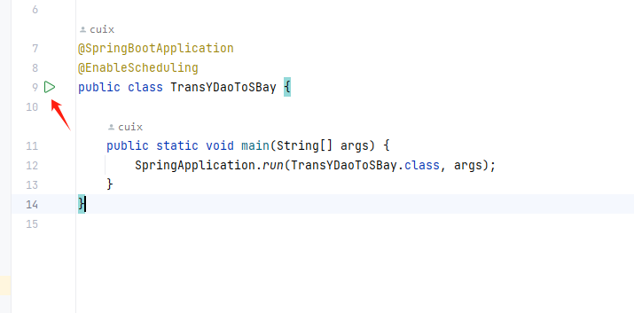

# SyncYd-Sbay

## description

我在PC端查找单词的App是有道词典，在移动端使用扇贝单词来背单词
这导致了很多的不方便
所以我想如何将 有道的生词本 同步给 扇贝单词的生词本
于是有了这个仓库

DecodingUtils 是一个JS express服务，负责解码

SyncYdToSbay 是一个SpringBoot服务（只使用了Schedule，当然单使用Timer也可以搞定，为了方便以后扩展Web功能 ~~当然后期还会不会继续维护还不知道~~）

DecodingUtils 内的解码工具来自[解码工具](https://github.com/yihong0618/shanbay_remember/blob/main/api_utils.js)

非常感谢这个仓库作者！！！

当然，因为我的能力有限（对JS不太熟悉），为了能快速开发出来所
以弄了两个服务。以后如果有机会，并且合适的话会考虑全部换成express

## function

将有道中的生词本中最新添加的10个，同步到扇贝单词中（可以通过修改配置文件中的youdao:collectionUrl的limit进行修改）


每间隔一个小时执行一次（根据自己的需求进行修改，在类Schedule中）

## how to use 

1. 进入Decoding目录

```
npm install 
```

```
node Server.js
```
2. 将你有道和扇贝的Cookie添加入配置文件


3运行SpringBoot的启动文件




